# Arquitetura da Aplicação

## Visão geral

Este projeto consiste em uma **API REST de calculadora**, desenvolvida com Node.js e Express, cujo objetivo é disponibilizar operações matemáticas básicas por meio de endpoints HTTP.

O foco da aplicação é a simplicidade, mantendo uma estrutura organizada e clara, semelhante ao que é adotado em projetos reais de pequeno porte.

## Estilo arquitetural

A aplicação segue o modelo **Client–Server**, utilizando uma **API REST** como camada de comunicação entre o cliente (Postman, frontend ou qualquer outro consumidor) e a lógica da aplicação.

Internamente, foi adotada uma **arquitetura em camadas simples**, separando responsabilidades entre inicialização do servidor, configuração da aplicação, definição de rotas e implementação da lógica de negócio.

Essa abordagem facilita a manutenção do código e possíveis evoluções, caso o escopo do projeto seja ampliado no futuro.

## Fluxo de funcionamento da aplicação

O fluxo de uma requisição segue a seguinte sequência:

1. O cliente realiza uma requisição HTTP (`POST`) para um endpoint da API.
2. A requisição é recebida pelo **Express Router**.
3. A rota direciona a chamada para o **controller responsável** pela operação.
4. O controller valida os dados, executa a operação matemática e retorna a resposta.
5. O cliente recebe a resposta no formato JSON.

## Diagrama de fluxo da aplicação



## Estrutura de pastas

A estrutura do projeto está organizada da seguinte forma:

```
├── server.js
├── app.js
├── routes/
│   └── calculatorRoutes.js
└── controllers/
    ├── calculatorAddController.js
    ├── calculatorSubtractController.js
    ├── calculatorMultiplyController.js
    └── calculatorDivideController.js
```

## Responsabilidade de cada camada

- **server.js**  
  Responsável por iniciar o servidor e definir a porta de execução da aplicação.

- **app.js**  
  Centraliza as configurações do Express, middlewares e o registro das rotas.

- **routes/**  
  Define os endpoints da API e direciona as requisições para os controllers.

- **controllers/**  
  Implementam a lógica das operações matemáticas e o tratamento das requisições.

## Decisões técnicas

As decisões técnicas adotadas neste projeto priorizam simplicidade e clareza:

- **Node.js + Express**  
  Utilizados por serem leves, amplamente adotados no mercado e adequados para APIs REST simples.

- **Separação por controllers**  
  Cada operação matemática possui seu próprio controller, facilitando a leitura e a organização do código.

- **Comunicação via JSON**  
  Utilizada como padrão de troca de informações entre cliente e servidor.

## Pontos de melhoria e evolução futura

Mesmo sendo um projeto simples e com escopo bem definido, algumas possíveis evoluções foram mapeadas:

- Centralizar a validação de dados de entrada.
- Criar uma camada de service para concentrar a lógica de cálculo.
- Implementar testes automatizados.

## Considerações finais

A arquitetura adotada atende ao escopo atual da aplicação, mantendo o código organizado e fácil de entender.

A estrutura apresentada serve como base para projetos simples de API e pode ser reaproveitada ou expandida conforme novas necessidades surgirem.
